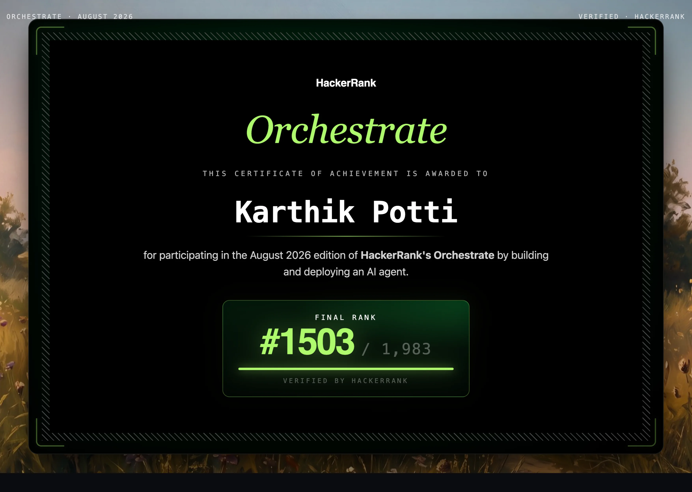

# Karthik Potti
**Full Stack Developer & AI Engineer | Enterprise Microservices & GenAI Agentic Systems**

* **Phone:** +91 9515759632
* **Email:** [karthikpotti842@gmail.com](mailto:karthikpotti842@gmail.com)
* **Location:** Hyderabad, India
* **GitHub:** [github.com/KarthikP-Mac](https://github.com/KarthikP-Mac)
* **Hugging Face:** [huggingface.co/KarthikP-Mac/spaces](https://huggingface.co/KarthikP-Mac/spaces)
* **Portfolio:** [karthikp-mac-portfolio.vercel.app](https://karthikp-mac-portfolio.vercel.app/)
* **Google Developer Profile:** [g.dev/karthikPMac](https://g.dev/karthikPMac)
* **LinkedIn:** [linkedin.com/in/karthik-potti842](http://www.linkedin.com/in/karthik-potti842)

---

## Professional Summary

Results-driven Full Stack Developer and AI Engineer with 4+ years of professional experience at Tata Consultancy Services (TCS), specializing in enterprise-scale web applications, distributed system design, and Generative AI solutions for the BFSI sector. Expert in architecting microservices and single-page applications using Java, Spring Boot, React, Angular, and Node.js. Proven track record of designing high-performance Retrieval-Augmented Generation (RAG/CRAG) pipelines using LangChain, LangGraph, and FAISS Vector databases, automating business workflows via AutoGen Multi-Agent frameworks, and deploying containerized services on Azure Kubernetes Service (AKS). Accomplished in remediating 100+ security vulnerabilities, reducing CI/CD deployment time by 70%, and decreasing system Mean Time to Resolution (MTTR) by 45% while achieving 100% security audit compliance.

---

## Technical Skills

* **Programming Languages:** Java, Python, JavaScript, TypeScript, C, HTML5, CSS3
* **Frontend:** React, Angular, Angular Material, Vite, Bootstrap, Materialize CSS, jQuery, CSS3, PWA, Font Awesome
* **Backend:** Java Spring Boot, Node.js, Express.js, Flask, FastAPI, REST APIs, WebSocket, Microservices
* **Desktop & UI:** Tkinter (Python GUI)
* **AI / ML / GenAI:** LangChain, LangGraph, AutoGen AI, AI Agents, RAG, CRAG, Prompt Engineering, FAISS Vector DB, Azure RAG Index, Groq API, OpenAI API, Gemini API, Claude API, ElevenLabs, ONNX Runtime (Kokoro), Streamlit, Azure OCR, Microsoft Logic Apps
* **Databases:** Oracle SQL, MySQL, MongoDB, Firebase Firestore
* **Cloud & DevOps:** Azure DevOps (CI/CD), Docker, Azure Kubernetes, GitHub Actions, Vercel, Render, Hugging Face Spaces
* **Security & Tools:** JWT Authentication, RBAC (Role-Based Authorization), OAuth2 (Google Sign-In / Firebase Auth), Veracode, Maven, Postman, WinSCP, Linux, Git, GitHub, Power BI

---

## Professional Experience

### Tata Consultancy Services (TCS)
**IT Systems Engineer — Full Stack & AI Developer** | *Client: Equitable Financial Life Insurance (BFSI)*  
*May 2022 – Present* | *Hyderabad, India*

#### Project 1: GenAI — Upsell, Cross-Sell & Operational Call Intelligence
*Role: AI Developer & Automation Engineer*

* Architected and deployed end-to-end **Generative AI pipelines** using **Python**, **LangChain**, and **RAG** to extract and analyze **7,000–9,000 daily call recording transcripts** from **Genesys PureCloud** into SQL, surfacing upsell/cross-sell client insights at scale and improving data processing throughput by 40%.
* Automated multi-step report generation and stakeholder distribution using **AutoGen** multi-agent workflows and **Microsoft Logic Apps**, saving 15+ manual hours per week.
* Designed and implemented a **Python-based OCR automation service** (Azure OCR) that parsed and processed user-uploaded PDFs, reducing document processing time by 80% and increasing data extraction accuracy to 99%.
* Engineered a responsive **React** frontend and **Flask** REST API backend, integrating embedded **Power BI** dashboards to deliver real-time operational insights, enhancing decision-making efficiency by 30%.
* Collaborated with cross-functional product teams to integrate AI pipelines into enterprise BFSI core services, boosting client engagement by 15% and ensuring seamless cross-system compatibility.

#### Project 2: Java Full Stack — Latte Rewrite & ACH Integration
*Role: Full Stack Developer*

* Developed high-throughput financial backend services using **Java Spring Boot** and dynamic UIs in **Angular** (**Angular Material** / **TypeScript**) within a **monolithic application** architecture for ACH payment integrations with Bank of America, securely processing $10M+ in quarterly transactions.
* Engineered a custom multi-window modal manager in **Angular** mimicking Windows Explorer desktop OS behavior — dynamically orchestrating z-index depth to bring active popups to foreground and stack inactive ones, improving UX for complex financial workflows.
* Orchestrated vulnerability remediations across 100+ critical financial REST APIs, centralizing security patches into a reusable **Maven JAR** artifact — achieving consistent compliance across 10+ microservices and reducing duplicate remediation effort by ~60%.
* Managed background automation batch jobs in a **Linux** environment, utilizing shell scripting and **WinSCP** for secure file transfers, achieving 99.9% pipeline reliability.

#### Cross-Project Contributions

* Developed and maintained **Angular** (**Angular Material** / **TypeScript**) and **React** component libraries alongside RESTful APIs using **Spring Boot** and **Flask**, reducing UI development cycles by 35% and enabling seamless UI–backend integration across multiple enterprise applications.
* Resolved 100+ application security vulnerabilities as part of Equitable's Vulnerability Remediation Team, achieving full compliance in **Veracode** security scans and internal audits.
* Designed secure REST APIs and UI flows using **JWT-based authentication** and **role-based authorization (RBAC)**, achieving 100% pass rate in all internal security compliance audits.
* Optimized **CI/CD pipelines** in **Azure DevOps**, slashing manual deployment overhead by **70%** and increasing release frequency by 3x.
* Implemented centralized logging and observability using **Azure Kubernetes Service (AKS)** monitoring and loggers, reducing Mean Time to Resolution (MTTR) by 45% across distributed **microservices**.
* Owned end-to-end **system design** across multiple enterprise applications — architecting UI/UX layouts, REST API contracts, database schemas, GitHub Actions workflows, Azure Kubernetes clusters, and AI pipeline service integrations from requirements to production deployment.

---

## Projects & Portfolio

### GenAI & RAG Applications

#### HackerRank Orchestrate — Multimodal AI Notification Router — *[Preview Asset](assets/hackerrank_orchestrate_preview.webp)*
*Tech: Python | Pandas | LLM Prompt Engineering | OCR (Image Analysis) | ASR (Voice Notes) | Context Graph Building | Confidence Calibration*

* Engineered an end-to-end **AI-powered WhatsApp message notification router** in a 24-hour HackerRank hackathon, processing multimodal inputs (text, image posters/screenshots, and voice notes) to classify messages into `notify`, `digest`, or `mute` actions with confidence scoring.
* Built a dynamic **context-builder** synthesizing 12+ data sources — user behavior, group metadata, business sender history, message events, and daily notification load — to produce personalized routing decisions per user.
* Implemented **media processing pipelines** for OCR-based image analysis and ASR-based voice note transcription, enabling multimodal reasoning over non-text message content.

#### BFSI Banking AI Copilot & Agentic RAG Pipeline — *[Live Demo](https://karthikp-mac-banking-ai-copilot.hf.space/)*
*Tech: Python | LangChain | CRAG | FAISS Vector DB | Streamlit | Multi-LLM Orchestration (Groq API, Qwen3.6 27B) | Hugging Face*

* Developed an enterprise financial assistant using a **Corrective RAG (CRAG)** pipeline with **FAISS Vector DB** semantic retrieval and a **Multi-Model LLM Orchestration** architecture &mdash; configured with **Qwen3.6 27B** (qwen/qwen3.6-27b) as the primary reasoning engine with dynamic fallback routing across Llama 3.3 and GPT-OSS to manage token limits and optimize query costs.
* Designed modular **LangChain** retrieval chains with pluggable model-routing middleware for zero-downtime hot-swapping of LLM backends without pipeline refactoring.

#### Jarvis Multimodal Voice-to-Voice AI Assistant — *[Live Demo](https://karthikp-mac-jarvis-ai-assistant.hf.space/)*
*Tech: Vite + React | FastAPI (ASGI) | Python | WebSockets | Groq (Whisper + Qwen3.6 27B) | ONNX Runtime (Kokoro) | ElevenLabs | Docker | Hugging Face*

* Engineered a real-time **Multimodal Voice-to-Voice AI Assistant** featuring a **React UI** and a **FastAPI ASGI** server handling duplex **WebSocket** streaming of raw audio packets.
* Implemented dual-engine speech synthesis (cloud-based **ElevenLabs** and local **Kokoro-ONNX** Runtime for zero-latency voice generation) paired with Groq Whisper speech-to-text.
* Integrated a **Multi-Model LLM Routing Layer** powered by **Groq API**, protected by a double-layered regex safety guardrail.

---

### Real-Time Web Applications

#### WebRTC Real-Time Video Conferencing Engine — *[Live Demo](https://web-rtc-lq00.onrender.com/)*
*Tech: React | WebRTC | Spring Boot | Java 21 Virtual Threads | WebSockets | Docker | Render*

* Developed a peer-to-peer video conferencing platform with real-time screen sharing, signaling handling, and adaptive media stream controls. Backend powered by **Java 21 Virtual Threads** (Project Loom) for high-concurrency WebSocket signaling, deployed as a containerized **Docker microservice** on Render.

#### Real-Time WebSocket Chat Infrastructure — *[Live Demo](https://web-sockets-ju5x.onrender.com/)*
*Tech: Angular | Spring Boot | WebSocket (STOMP) | Microservices | Docker | Render*

* Built a real-time messaging architecture using **STOMP protocol over WebSockets**, ensuring bi-directional low-latency data flow with active user connection tracking, deployed as a containerized **Docker microservice** on Render.

#### Sticky-Notes Workspace (Progressive Web App) — *[Live Demo](https://stickynotes-pk-mac.vercel.app/)*
*Tech: React | PWA | Firebase Firestore | Firebase Auth (Google OAuth2) | LocalStorage | Vercel*

* Engineered a **React PWA** digital workspace with interactive Kanban/Canvas views, custom drag-and-drop mechanics, **Google OAuth2** authentication via Firebase Auth, and **Firebase Firestore** offline data synchronization for persistent multi-tab state management.

---

### Institutional & Full Stack Web Portals

#### Enterprise Institution Web Portal (Full Stack) — *[Live Website](https://adarsh-computers.vercel.app/)*
*Tech: React | Node.js | Express.js | REST APIs | Bootstrap | SMTP | Vercel | Render*

* Developed a full-stack web portal managing course enrollment, student records, announcements, and online quizzes using **React**, **Node.js**, **Express.js** REST APIs, and automated SMTP email notifications.

#### Responsive Institution Landing Portal
*Tech: HTML5 | CSS3 | JavaScript (ES6+) | jQuery | Bootstrap | Mobile-First UX*

* Built a responsive frontend web portal featuring dynamic landing pages, mobile-first CSS layouts, cross-browser compatibility, and interactive UI components for a computer education institution.

---

### Python Desktop Applications

#### Smart Stocker — Desktop ERP & Ledger System
*Tech: Python | Tkinter | SQLite3 | Excel (openpyxl) | Matplotlib Analytics | PDF Generation*

* Designed a standalone desktop ERP and ledger system using **Python (Tkinter)** and **SQLite3**, featuring local data caching, asynchronous background auto-saves, and Matplotlib-based analytics dashboards.
* Implemented an automated stock advisory module providing real-time stock alert thresholds and predictive profit forecasting.
* Integrated secure PDF document compilation for automated generation of invoices, purchase orders, and monthly ledger sheets.

#### PDF Batch Processing & Document Automation Utility
*Tech: Python | Tkinter | PyPDF | Pillow | File Automation | Windows APIs*

* Engineered a desktop utility using **Python (Tkinter)** to batch convert entire folders of images into high-quality, compressed PDFs with a live progress renderer.
* Supports custom page and image ordering with a live sequence preview before exporting the final PDF.
* Implemented selective page extraction and image-only extraction from existing PDF documents.

#### System Power Automation & Task Scheduler
*Tech: Python | Tkinter | Windows OS APIs | JSON | Task Scheduling*

* Developed a system automation tool in **Python (Tkinter)** that schedules system events (shutdown, sleep, lock) via countdown timers and persistent daily schedules saved in JSON.
* Implemented a system-overlay countdown notification in the final 5 minutes of a scheduled event with password-protected controls.

---

## Certifications & Credentials

* **Frontend Developer (React)** — HackerRank *(React Architecture, State & Hooks, Component Lifecycle)* — [Verify](https://www.hackerrank.com/certificates/cf5fd5bbb5db)
* **Software Engineer** — HackerRank *(Data Structures, Algorithms, Software Architecture)* — [Verify](https://www.hackerrank.com/certificates/178cc7dbb188)
* **SQL (Advanced)** — HackerRank *(Window Functions, CTEs, Complex JOINs, Query Optimization)* — [Verify](https://www.hackerrank.com/certificates/e28ff148700a)
* **Angular (Intermediate)** — HackerRank *(Angular, TypeScript, RxJS, Reactive Forms)* — [Verify](https://www.hackerrank.com/certificates/b7f65df92357)
* **JavaScript (Intermediate)** — HackerRank *(ES6+, Promises & Async, Closures, DOM)* — [Verify](https://www.hackerrank.com/certificates/0467c8815451)
* **Node.js (Intermediate)** — HackerRank *(Node.js, Express.js, Asynchronous I/O)* — [Verify](https://www.hackerrank.com/certificates/cfc75f00230f)
* **REST API (Intermediate)** — HackerRank *(RESTful APIs, HTTP Protocols, JSON, API Design)* — [Verify](https://www.hackerrank.com/certificates/571f27af280d)
* **Python (Basic)** — HackerRank *(Python 3, OOP, Data Structures)* — [Verify](https://www.hackerrank.com/certificates/d45aabbcdc0a)
* **Java (Basic)** — HackerRank *(Java Core, OOP Design, Collections Framework)* — [Verify](https://www.hackerrank.com/certificates/93c7356dae25)
* **CSS** — HackerRank *(CSS3, Flexbox, CSS Grid, Responsive Layouts)* — [Verify](https://www.hackerrank.com/certificates/4346a0115e77)

---

## Education

* **B.Tech. in Computer Science & Engineering** — NRI Institute of Technology (2021) | CGPA: **7.68 / 10**
* **Diploma in Science & Technology** — Amrita Sai Institution (2018) | **75.2%**
* **Secondary School (SSC)** — Ravindra Bharati Public School (2015) | **82.0%**

---

## Languages

* **English:** Professional Working Proficiency
* **Telugu:** Native / Bilingual Proficiency
* **Hindi:** Full Professional Proficiency
