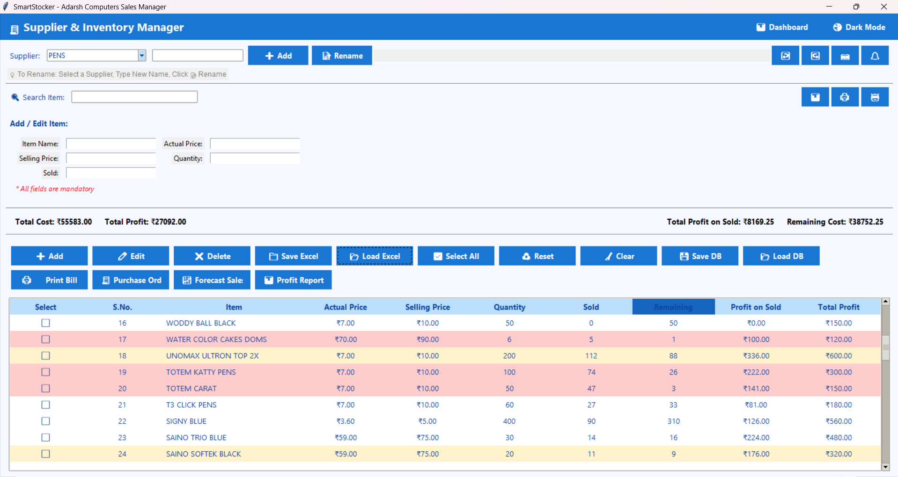
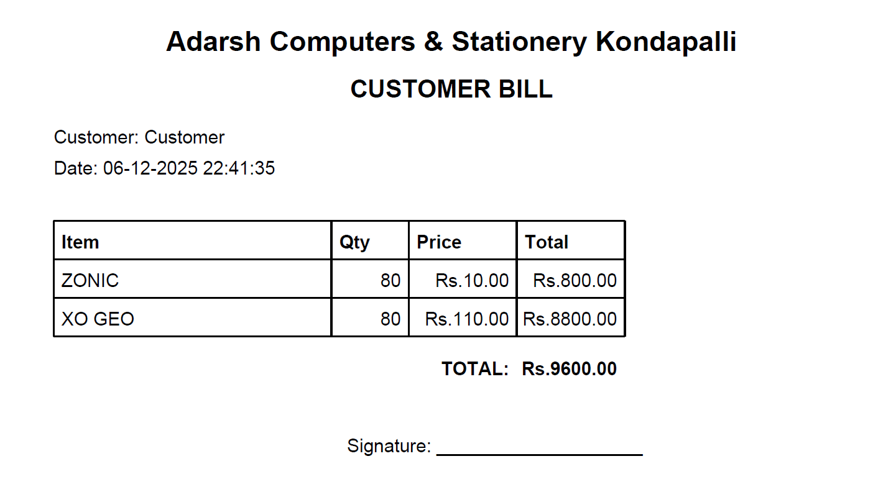
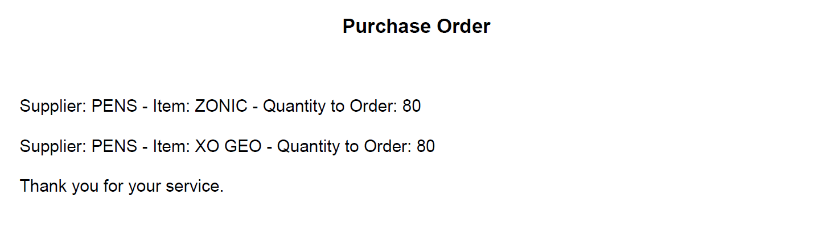
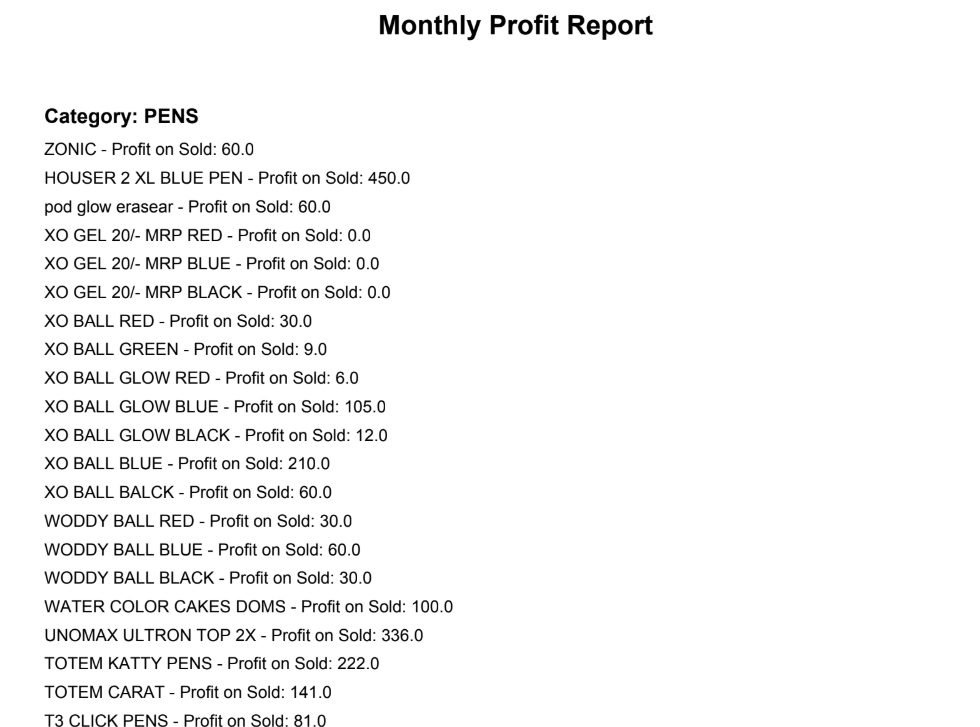
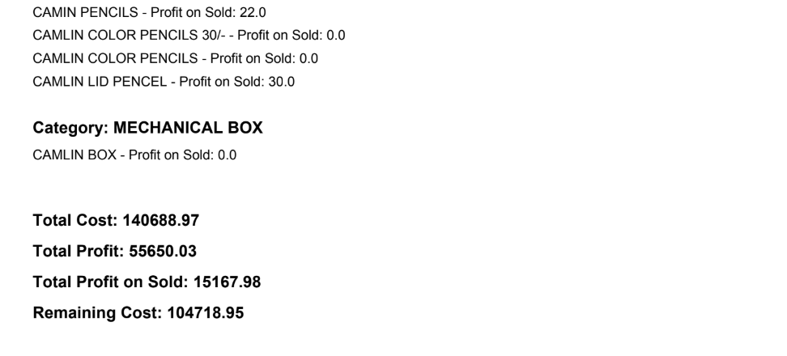
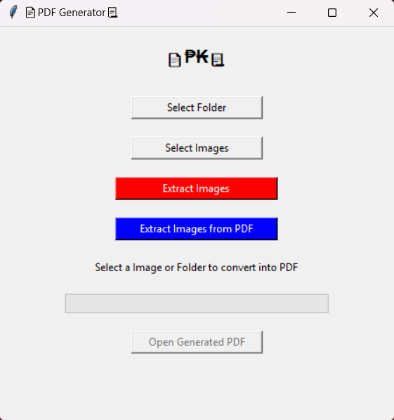
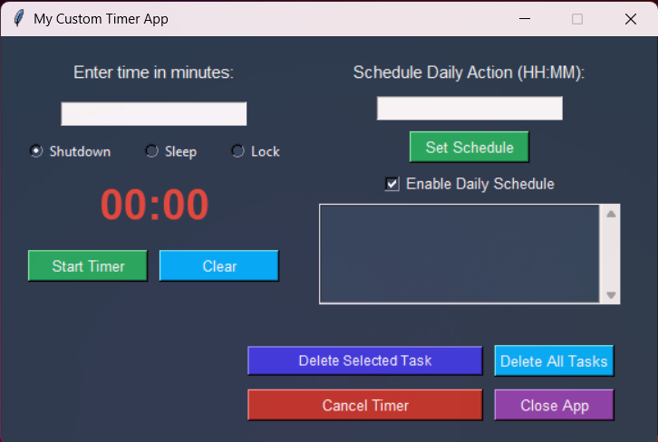

<!--  -->

<h1 align="center">Hi 👋, I'm Karthik Potti</h1>

  

- 💬 Ask me about **React, Angular, Typescript, Javascript, Java, Spring Boot, Node.js, Flask, Python and AI Agents.**
- 📫 How to reach me **<a href="mailto:karthikpotti842@gmail.com" target="_blank">karthikpotti842@gmail.com</a>**
- 👨‍💻 Know about me **<a href="https://github.com/KarthikP-Mac" target="_blank">karthikp-mac.github.io</a>**
- 🚀 Google Developer Profile **<a href="https://g.dev/karthikPMac" target="_blank">g.dev/karthikPMac</a>**
- 🐧 Automation & Scripting **Linux automation using Java & WinSCP**
<!-- - 📄 Resume (Live Preview) **[Karthik's Resume](https://karthikp-mac.github.io/KarthikP-Mac/Karthik_Potti_Resume.html)** -->
<!-- - 📄 Know about my experiences **[Karthik's Resume](https://github.com/KarthikP-Mac/KarthikP-Mac/blob/main/Karthik_Potti_Resume.html)** -->
<!-- - 📄 Resume (Live Preview) **[Karthik's Resume](https://htmlpreview.github.io/?https://github.com/KarthikP-Mac/KarthikP-Mac/blob/main/Karthik_Potti_Resume.html)**
- 📄 Resume (Markdown) **[Karthik's Resume](Karthik_Potti_Resume.md)** -->
- 📄 Resume (Live Preview) **<a href="https://htmlpreview.github.io/?https://github.com/KarthikP-Mac/KarthikP-Mac/blob/main/Karthik_Potti_Resume.html" target="_blank">Karthik's Resume</a>**
- 📄 Resume (Markdown) **<a href="Karthik_Potti_Resume.md" target="_blank">Karthik's Resume</a>**

  
  
  
  
  
  
  

---

## 🛠️ Projects & Portfolio

### 🌐 Web-RTC & Real-Time Web Apps (Public)

*   **Web-RTC (Live Random Video Calls)**
    *   *Description:* Real-time video calling application with media controls, peer-to-peer streaming, and screen sharing.
    *   *Live Demo:* [web-rtc-lq00.onrender.com](https://web-rtc-lq00.onrender.com/)
    *   *Tech Stack:*  
      
     <!--  -->
    
    

*   **Web-Sockets (Live Chats)**
    *   *Description:* Real-time instant messaging application ensuring reliable end-to-end delivery of chat messages.
    *   *Live Demo:* [web-sockets-ju5x.onrender.com](https://web-sockets-ju5x.onrender.com/)
    *   *Tech Stack:*    
    <!--  -->
    
    

---

### 🤖 Artificial Intelligence & RAG Agents (Public)

*   **BFSI-Insurance-Ai-Agent (Banking AI Copilot)**
    *   *Description:* An intelligent finance & banking AI assistant that answers domain-specific queries. Leverages a robust CRAG pipeline with a custom recursive character splitter and FAISS vector database.
    *   *Live Demo:* [karthikp-mac-banking-ai-copilot.hf.space](https://karthikp-mac-banking-ai-copilot.hf.space/)
    *   *Tech Stack:*      `CRag`
    *   *LLM Models Supported:* Groq, Gemini, OpenAI, Claude.
    
    

---

### 💼 Live Institutional Web Applications (Private)

*   **Adarsh Computers Portal**
    *   *Description:* A comprehensive educational portal built for an institution to manage courses, students, and announcements.
    *   *Live Website:* [adarsh-computers.vercel.app](https://adarsh-computers.vercel.app/)
    *   *Frontend Tech:*  
    
    
    *   *Backend Tech:*    `SMTP`
    <!--   -->
    <!--  -->
    
    

*   **First-Web-Site**
    *   *Description:* Initial iteration of the institutional website focusing on responsive structure and classic frontend styling.
    *   *Tech Stack:*     

---

### 🖥️ Portable Python Desktop Software (Tkinter)

*   **Smart Stocker (Ledger Application)**
    *   *Description:* Portable software for stock, ledger, and sales entry tracking built with Python's GUI framework.
    *   *Tech Stack:*  
    
    
    
    *Application Output & Report Showcase:*
    <table>
      <tr>
        <td width="50%"><b>Customer Bill</b> </td>
        <td width="50%"><b>Purchase Order</b> </td>
      </tr>
      <tr>
        <td width="50%"><b>Monthly Profit Report (Setup)</b> </td>
        <td width="50%"><b>Monthly Profit Report (Export)</b> </td>
      </tr>
    </table>

*   **Python-Pdf Utility**
    *   *Description:* Utility for generating PDFs from directories, selecting files/folders, and extracting text or images.
    *   *Tech Stack:*  `PyPDF` `ReportLab` 
    
    

*   **Auto Power Off Timer**
    *   *Description:* Portable utility to easily schedule automatic sleep, shutdown, or restart commands on Windows PCs.
    *   *Tech Stack:*   
    
    

---

### 💻 Other Projects

*   **Movie Seat Booking**
    *   *Description:* Interactive movie theater seat booking interface with real-time seat selection, ticket price calculations, and local storage state persistence.
    *   *Tech Stack:*   

*   **DOM Array Methods Dashboard**
    *   *Description:* Dynamic dashboard demonstrating functional programming array methods (`map`, `filter`, `sort`, `reduce`) to fetch random users and calculate total net wealth.
    *   *Tech Stack:*   

*   **Exchange Rate Calculator**
    *   *Description:* Real-time foreign exchange rate calculator that fetches live currencies from a third-party API and handles direct conversions.
    *   *Tech Stack:*   

*   **Custom Video Player**
    *   *Description:* Custom-styled HTML5 media player showcasing play/pause states, interactive progress slider, timestamp display, and volume control interface.
    *   *Tech Stack:*   

*   **Form Validator**
    *   *Description:* Modern client-side form registration validation utility with dynamic success/error styling and input validation checks.
    *   *Tech Stack:*   

*   **Menu Slider & Modal**
    *   *Description:* Smooth UI navigation layout showing a slide-out sidebar overlay and styled transaction modal dialogs using CSS transitions.
    *   *Tech Stack:*   

*   **Calculator**
    *   *Description:* A beautiful, responsive standard web calculator with clean UI.
    *   *Tech Stack:*   

*   **JSON Card Generator**
    *   *Description:* Dynamically renders styled product cards from a JSON data array using JavaScript DOM manipulation, featuring images, descriptions, and pricing.
    *   *Tech Stack:*   

*   **Click-to-Toggle Visibility UI**
    *   *Description:* Interactive toggle component that reveals and hides content sections on click, demonstrating JavaScript event-driven DOM visibility control.
    *   *Tech Stack:*   

*   **HTML Frameset Navigation**
    *   *Description:* Multi-frame HTML layout using framesets with a navigation menu that targets and loads different pages (including external URLs) into specific frames.
    *   *Tech Stack:*  

*   **ParcelYogi Landing Page Clone**
    *   *Description:* Pixel-perfect responsive landing page clone of a shipping service website, featuring hero sections, call-to-action buttons, and custom Google Fonts.
    *   *Tech Stack:*  

*   **Responsive Product Comparison Page**
    *   *Description:* Multi-breakpoint responsive product comparison layout with media queries targeting different screen sizes, showcasing CSS-only adaptive design patterns.
    *   *Tech Stack:*  

---

<h3 align="left">Connect with me:</h3>

  
  
  
  
  
  
  
  
  

<h3 align="left">🛠️ Skills & Technologies:</h3>

#### 💻 Programming & Frontend Development

)

#### ⚙️ Backend, Database & Deployment

#### 🤖 AI, LLM & Advanced RAG Systems

#### 🐧 Automation & Cloud Integration

> [!NOTE]
> **Java Automation:** Experienced in building Java-based automation tasks on Linux platforms and managing remote deployments/file transfers using WinSCP.

<h3 align="center">GitHub Statistics</h3>

<!-- 

  
  &nbsp;
  

 -->
<!-- metrics.lecoq.io removed — service is unreliable and shows stale/incorrect repo counts -->

  
  &nbsp;
  
<!--  -->

  

  

<h3 align="center">Profile Cards</h3>

  
  
  
  
  

  

<h3 align="left">⚡ Activity Graph:</h3>

  

